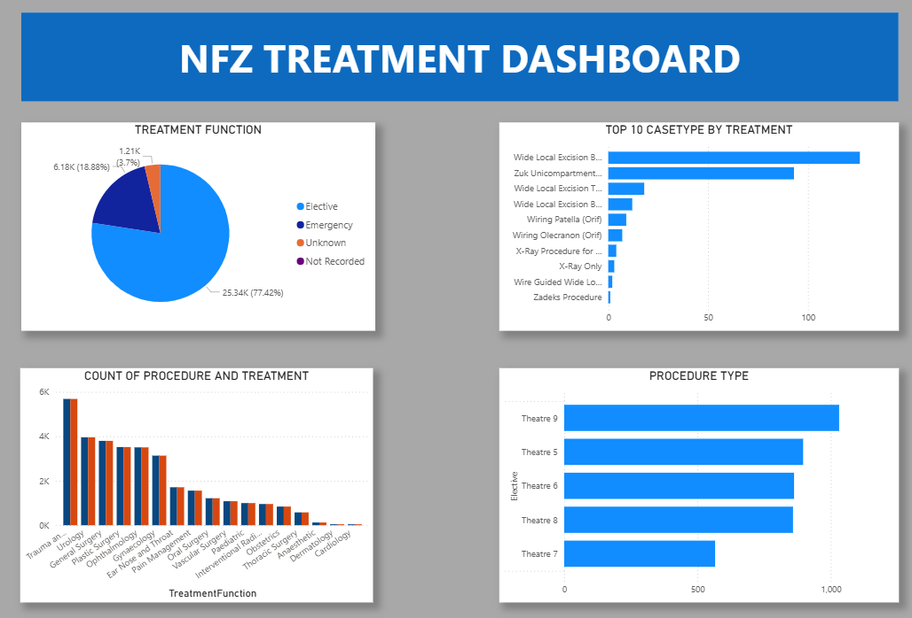

# **Toluwase Ashaolu's Data Analysis projects**

## [Project 1: Power BI data transformation Project](https://github.com/Ashyboss/Power_BI_Dashboards)
This Project showcase two projects analysing Data from two different clinics to create an insight of the time specialist spend at a clinic and the project is aimed to see how to optimise the time clinical and non-clinical spend on patients and overall help clinical staffs manage time.

## [Project 2: Excel- Power Query](https://github.com/Ashyboss/Data_Transformation_using-_power_Query)
This project was for a Data manipulation and cleaning project before transfer to build insight. This Live Dashboard showing overral overview of the CLinic from the Waitlist, to the top 5 specialist with the most operations and the Time band vas Age profile. which is also life field

*[Live Dashobard](https://github.com/Ashyboss/Toluwase-Ashaolu-s-DATA-projects/blob/main/image.png)*
